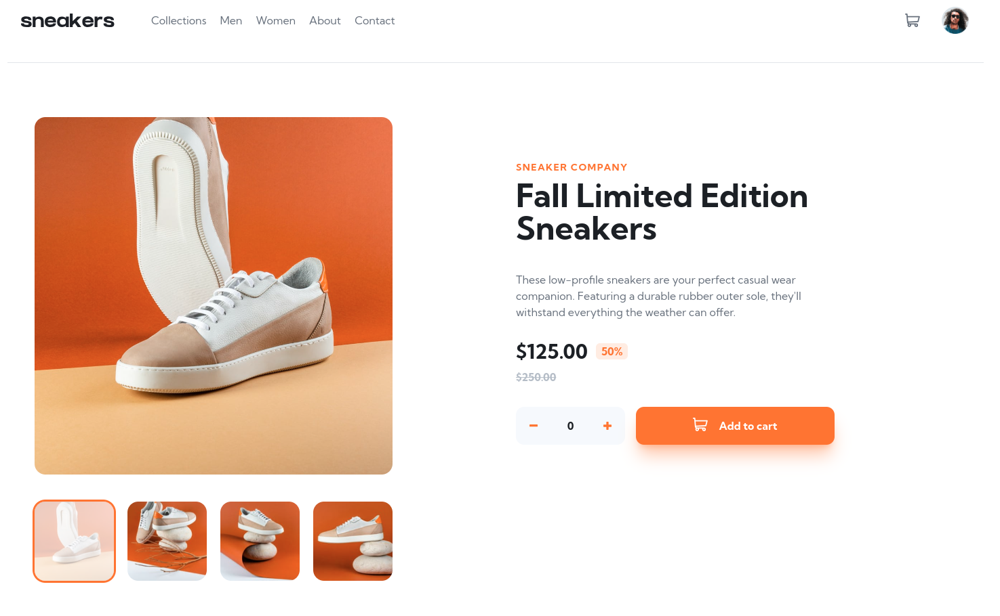
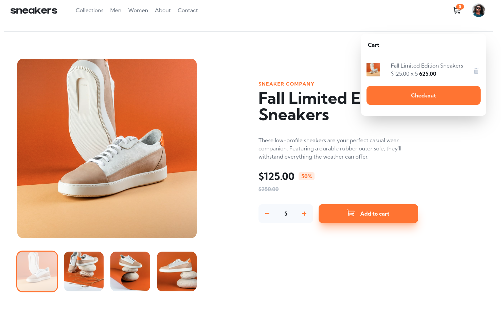
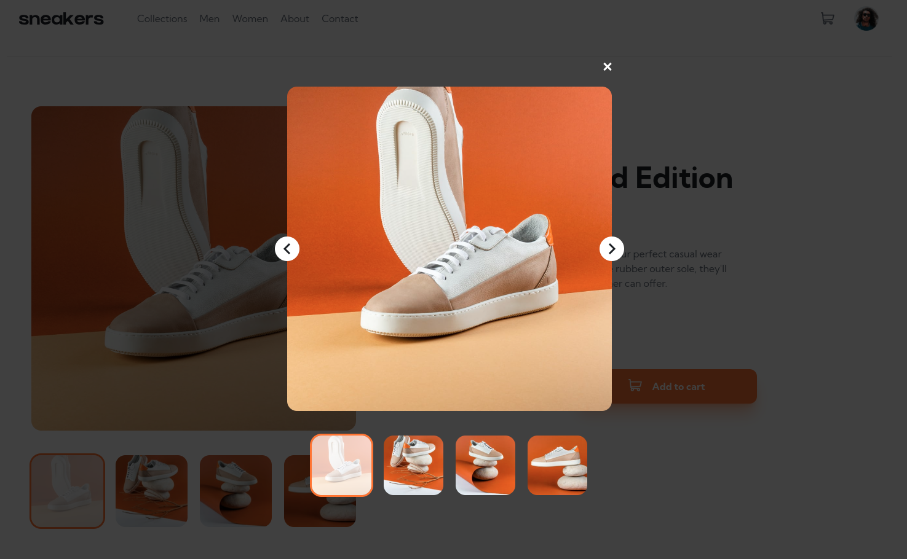
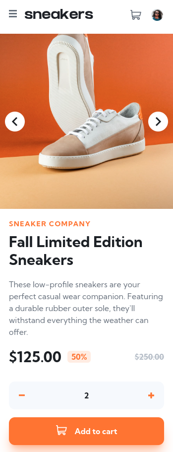
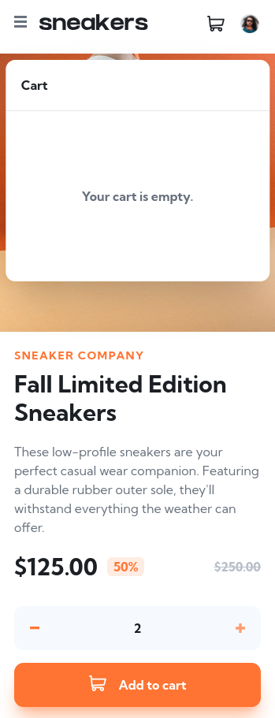
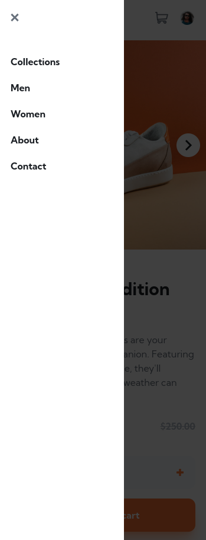

# 👨‍💻‍ Sobre o projeto
Esse projeto foi inspirado em um <a href="https://www.frontendmentor.io/challenges/ecommerce-product-page-UPsZ9MJp6" target="_blank">desafio</a> do site
<a href="https://www.frontendmentor.io/" target="_blank">frontend mentor</a> que simula um E-commerce para sneakers. 
Fiz esse desafio com o intuito de praticar fundamentos de React  juntamente com o Tailwind.

Deploy na Vercel: https://ecommerce-product-page-main-xi-rosy.vercel.app/

### 🧰 Ferramentas Utilizadas

- <a href="https://react.dev/" target="_blank">React</a>
- <a href="https://create-react-app.dev/" target="_blank">Create React App</a>
- <a href="https://tailwindcss.com/" target="_blank">Tailwind</a>
- <a href="https://prettier.io/" target="_blank">Prettier</a>
- <a href="https://docs.npmjs.com/downloading-and-installing-node-js-and-npm" target="_blank">NPM</a>
- <a href="https://www.docker.com/" target="_blank">Docker</a>

## 💿 Como rodar na sua máquina

### Pré-requisitos

- **Git**;
- **Docker + Docker-Compose (caso queira utilizar Docker)**;
- **Node + NPM (caso queira instalar as dependências na sua máquina)**;

```shell
# Clone o repositório na sua máquina
$ git clone https://github.com/lleonardus/ecommerce-product-page-main

# Abra a pasta do projeto
$ cd ecommerce-product-page-main
```
Agora é só escolher sua forma favorita de rodar o projeto:

<details>
    <summary><b>🐳 Utilizando Docker</b></summary>

```shell
# Inicie o projeto usando docker
$ docker-compose up -d
```
</details>

<details>
    <summary><b>📦 Utilizando Node</b></summary>

```shell
# Instale as dependências
$ npm i

# Inicie o projeto
$ npm start 
```
</details>

Após esse processo, o App vai estar rodando em **http://localhost:3000**

## 📸 Screenshots

### 💻 Desktop

#### Padrão

#### Carrinho aberto e com items

#### Lightbox Gallery


### 📱 Mobile

#### Padrão

#### Carrinho aberto e vazio

#### Menu aberto

